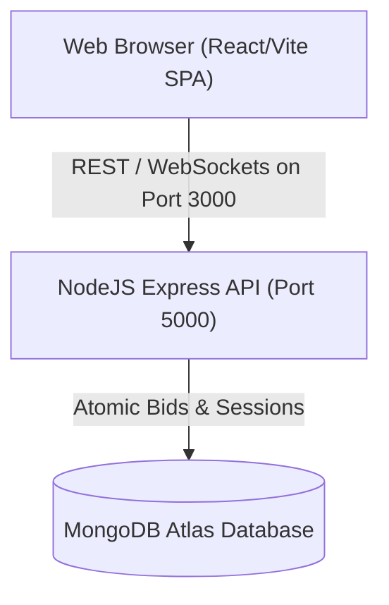

# System Architecture & Design

VelocityAuction is built using a highly decoupled, modern client-server layout designed for cloud-native platforms.

---

## 🏗️ Architecture Design

The following diagram represents the simplified structure:

---

## 📂 Backend Layered Design Pattern

The API codebase conforms to a strict layered separation of concerns:

1. **Routes Layer**: Exposes endpoint patterns, validation constraints, sanitizers, and binds request callbacks to controllers.
2. **Controllers Layer**: Extracts request payloads, cookies, route parameters, and delegates business evaluations to Services.
3. **Services Layer**: Orchestrates business rules, database fetches, atomic updates, and triggers Socket.io room events.
4. **Repositories Layer**: Encapsulates database schema mutations and optimizes index queries.
5. **Models Layer**: Defines strict TypeScript typings and schema structures.

---

## 🔒 Concurrency Control & Bidding Locks

To ensure that bids are placed in absolute sequential order and avoid race conditions (e.g. two bids checking database states simultaneously and bypassing increment validation), the application implements an **optimistic concurrency lock** at the database level:

1. A client submits a bid.
2. `BidService` creates a bid document.
3. It atomically updates the auction document using MongoDB's `findOneAndUpdate`:
   - Match Criteria: `_id: auctionId` AND `highestBidAmount < newBidAmount` (or `highestBidAmount == 0` for first bids).
   - If a parallel bid has already written a higher amount in the exact same millisecond, the query fails to find a match.
   - If the query fails to write (returns `null`), the newly created bid document is rolled back (deleted) and the user receives a concurrent bidding warning.
4. This ensures transactional safety natively at the database level without requiring external distributed lock services (like Redis).

---

## ⏰ Automated Status Lifecycle Scheduler

Instead of writing custom cron schedules inside frontend modules, a background cron job runs every 15 seconds:
- **Scheduled to Live**: Starts auctions whose `startTime` has elapsed, updating state and broadcasting socket updates.
- **Live to Sold / Ended**: Inspects live listings whose `endTime` has passed, checking if reserve prices were met. Binds winner details and broadcasts updates.

---

## 🕵️ Traceability & Request Isolation

Using Node's `AsyncLocalStorage`, every incoming request is assigned a unique UUID `requestId`. When logs are written from Pino, this `requestId` is automatically included in the JSON record via a pino logger `mixin` callback. This supports tracing asynchronous operations end-to-end.
